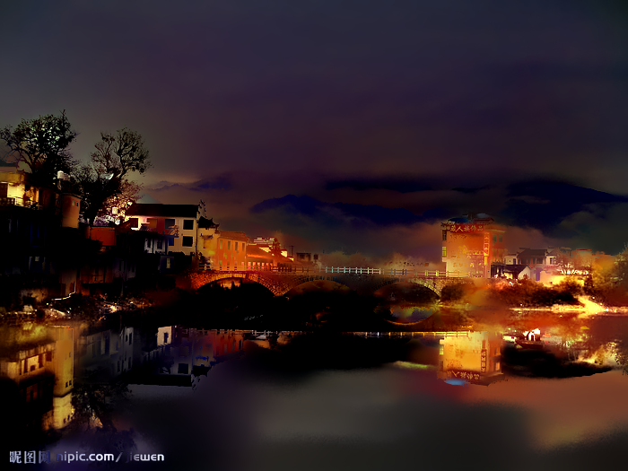
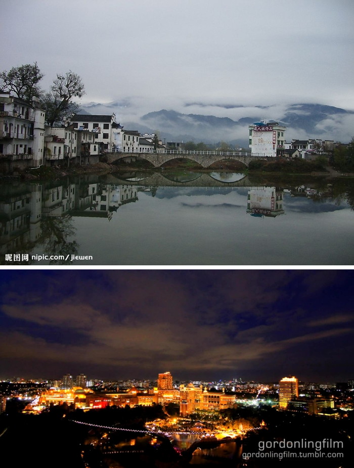
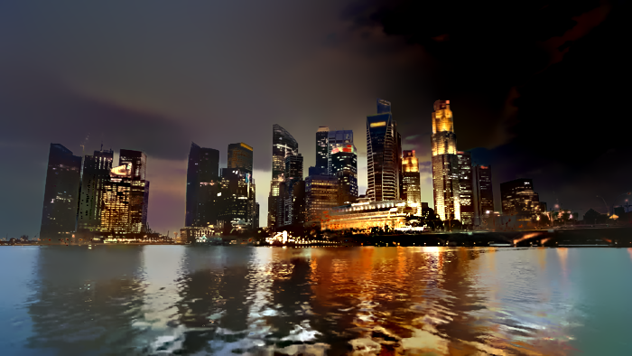
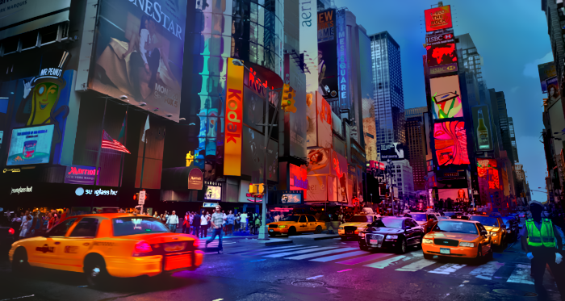
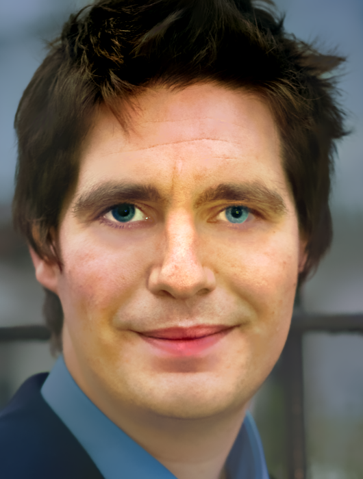

# deep-photo-styletransfer-tf

This is a pure Tensorflow implementation of [Deep Photo Styletransfer](https://arxiv.org/abs/1703.07511), the torch implementation could be found [here](https://github.com/luanfujun/deep-photo-styletransfer)

This implementation support [L-BFGS-B](https://www.tensorflow.org/api_docs/python/tf/contrib/opt/ScipyOptimizerInterface) (which is what the original authors used) and [Adam](https://www.tensorflow.org/api_docs/python/tf/train/AdamOptimizer) in case the ScipyOptimizerInterface incompatible when Tensorflow upgrades to higher version.

This implementation may seem to be a little bit simpler thanks to Tensorflow's [automatic differentiation](https://en.wikipedia.org/wiki/Automatic_differentiation)

Additionally, there is no dependency on MATLAB thanks to another [repository](https://github.com/martinbenson/deep-photo-styletransfer/blob/master/deep_photo.py) computing Matting Laplacian Sparse Matrix. Below is example of transferring the photo style to another photograph.

<p align="center">
    
    
</p>

## Disclaimer
**This software is published for academic and non-commercial use only.**

## Setup
### Dependencies
* [Tensorflow](https://www.tensorflow.org/)
* [Numpy](www.numpy.org/)
* [Pillow](https://pypi.python.org/pypi/Pillow/)
* [Scipy](https://www.scipy.org/)
* [PyCUDA](https://pypi.python.org/pypi/pycuda) (used in smooth local affine, tested on CUDA 8.0)

***It is recommended to use [Anaconda Python](https://www.continuum.io/anaconda-overview), since you only need to install Tensorflow and PyCUDA manually to setup. The CUDA is optional but really recommended***

### Download the VGG-19 model weights
The VGG-19 model of tensorflow is adopted from [VGG Tensorflow](https://github.com/machrisaa/tensorflow-vgg) with few modifications on the class interface. The VGG-19 model weights is stored as .npy file and could be download from [Google Drive](https://drive.google.com/file/d/0BxvKyd83BJjYY01PYi1XQjB5R0E/view?usp=sharing) or [BaiduYun Pan](https://pan.baidu.com/s/1o9weflK). After downloading, copy the weight file to the **./project/vgg19** directory

## Usage
### Basic Usage
You need to specify the path of content image, style image, content image segmentation, style image segmentation and then run the command

```
python deep_photostyle.py --content_image_path <path_to_content_image> --style_image_path <path_to_style_image> --content_seg_path <path_to_content_segmentation> --style_seg_path <path_to_style_segmentation> --style_option 2
```

*Example:*
```
python deep_photostyle.py --content_image_path ./examples/input/in11.png --style_image_path ./examples/style/tar11.png --content_seg_path ./examples/segmentation/in11.png --style_seg_path ./examples/segmentation/tar11.png --style_option 2
```

### Other Options

`--style_option` specifies three different ways of style transferring. `--style_option 0` is to generate segmented intermediate result like torch file **neuralstyle_seg.lua** in torch. `--style_option 1` uses this intermediate result to generate final result like torch file **deepmatting_seg.lua**. `--style_option 2` combines these two steps as a one line command to generate the final result directly.

`--content_weight` specifies the weight of the content loss (default=5), `--style_weight` specifies the weight of the style loss (default=100), `--tv_weight` specifies the weight of variational loss (default=1e-3) and `--affine_weight` specifies the weight of affine loss (default=1e4). You can change the values of these weight and play with them to create different photos.

`--serial` specifies the folder that you want to store the temporary result **out_iter_XXX.png**. The default value of it is `./`. You can simply `mkdir result` and set `--serial ./result` to store them. **Again, the temporary results are simply clipping the image into [0, 255] without smoothing. Since for now, the smoothing operations need pycuda and pycuda will have conflict with tensorflow when using single GPU**

Run `python deep_photostyle.py --help` to see a list of all options

### Image Segmentation
This repository doesn't offer image segmentation script and simply use the segmentation image from the [torch version](https://github.com/luanfujun/deep-photo-styletransfer). The mask colors used are also the same as them. You could specify your own segmentation model and mask color to customize your own style transfer.


## Examples
Here are more results from tensorflow algorithm (from left to right are input, style, torch results and tensorflow results)

<p align="center">
    
    
    
    
</p>

<p align="center">
    
    
    
    
</p>

<p align="center">
    
    
    
    
</p>

<p align="center">
    
    
    
    
</p>

<p align="center">
    
    
    
    
</p>

<p align="center">
    
    
    
    
</p>

## Acknowledgement

* This work was done when Yang Liu was a research intern at *Alibaba-Zhejiang University Joint Research Institute of Frontier Technologies*, under the supervision of [Prof. Mingli Song](http://person.zju.edu.cn/en/msong) and [Yongcheng Jing](http://yongchengjing.com/).

* Our tensorflow implementation basically follows the [torch code](https://github.com/luanfujun/deep-photo-styletransfer).

* We use [martinbenson](https://github.com/martinbenson)'s [python code](https://github.com/martinbenson/deep-photo-styletransfer/blob/master/deep_photo.py) to compute Matting Laplacian.

## Citation
If you find this code useful for your research, please cite:
```
@misc{YangPhotoStyle2017,
  author = {Yang Liu},
  title = {deep-photo-style-transfer-tf},
  publisher = {GitHub},
  organization={Alibaba-Zhejiang University Joint Research Institute of Frontier Technologies},
  year = {2017},
  howpublished = {\url{https://github.com/LouieYang/deep-photo-styletransfer-tf}}
}
```

## Contact
Feel free to contact me if there is any question (Yang Liu lyng_95@zju.edu.cn).
